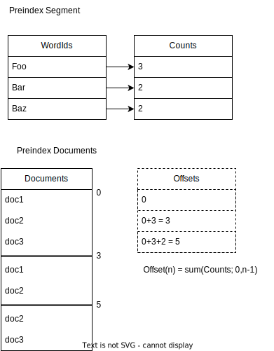
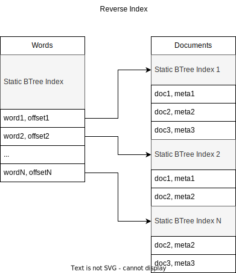

# Index

This index subsystem contains the components that make up the search index.

It exposes an API for querying the index, and contains the logic 
for ranking search results.  It does not parse the query, that is
the responsibility of the [search-query](../functions/search-query) module.

The central class of the index subsystem is the [IndexGrpcService](java/nu/marginalia/index/IndexGrpcService.java) class,
which is a gRPC service that exposes the index to the rest of the system.

## Indexes

There are two indexes with accompanying tools for constructing them.

* Reverse Index is code for `word->document` indexes. There are two such indexes, one containing only document-word pairs that are flagged as important, e.g. the word appears in the title or has a high TF-IDF. This allows good results to be discovered quickly without having to sift through ten thousand bad ones first. 

* Forward Index is the `document->word` index containing metadata about each word, such as its position. It is used after identifying candidate search results via the reverse index to fetch metadata and rank the results. 

Additionally, the [index-journal](index-journal/) contains code for constructing a journal of the index, which is used to keep the index up to date.

These indices rely heavily on the [libraries/skiplist](../libraries/skiplist), [libraries/btree](../libraries/btree) and [libraries/array](../libraries/array) components.

## Reverse Index

The reverse index contains a mapping from word to document id.

There are two tiers of this index.

* A priority index which only indexes terms that are flagged with priority flags1.
* A full index that indexes all terms.

The full index also provides access to term-level metadata, while the priority index is
a binary index that only offers information about which documents has a specific word.

The priority index is also compressed, while the full index at this point is not.

[1] See WordFlags in [common/model](../common/model/) and
KeywordMetadata in [converting-process/ft-keyword-extraction](../processes/converting-process/ft-keyword-extraction).

### Construction

The reverse index is constructed by first building a series of preindexes.
Preindexes consist of a Segment and a Documents object.  The segment contains
information about which word identifiers are present and how many, and the
documents contain information about in which documents the words can be found.

These would typically not fit in RAM, so the index journal is paged
and the preindexes are constructed small enough to fit in memory, and
then merged.  Merging sorted arrays is a very fast operation that does
not require additional RAM.

Once merged into  one large preindex, indexes are added to the preindex data
to form a finalized reverse index.

**FIXME**:  The illustration below is incorrect, the data is stored in a skiplist
and not a btree.

### Central Classes

Full index:
* [FullPreindex](java/nu/marginalia/index/reverse/construction/full/FullPreindex.java) intermediate reverse index state.
* [FullIndexConstructor](java/nu/marginalia/index/reverse/construction/full/FullIndexConstructor.java) constructs the index.
* [FullReverseIndexReader](java/nu/marginalia/index/reverse/FullReverseIndexReader.java) interrogates the index.

Prio index:
* [PrioPreindex](java/nu/marginalia/index/reverse/construction/prio/PrioPreindex.java) intermediate reverse index state.
* [PrioIndexConstructor](java/nu/marginalia/index/reverse/construction/prio/PrioIndexConstructor.java) constructs the index.
* [PrioIndexReader](java/nu/marginalia/index/reverse/PrioReverseIndexReader.java) interrogates the index.

# Forward Index

The forward index contains a mapping from document id to various forms of document metadata.

In practice, the forward index consists of two files, an `id` file and a `data` file.

The `id` file contains a list of sorted document ids, and the `data` file contains
metadata for each document id, in the same order as the `id` file, with a fixed
size record containing data associated with each document id.

Each record contains a binary encoded [DocumentMetadata](../common/model/java/nu/marginalia/model/idx/DocumentMetadata.java) object,
as well as a [HtmlFeatures](../common/model/java/nu/marginalia/model/crawl/HtmlFeature.java) bitmask.

Unlike the reverse index, the forward index is not split into two tiers, and the data is in the same
order as it is in the source data, and the cardinality of the document IDs is assumed to fit in memory,
so it's relatively easy to construct.

## Central Classes

* [ForwardIndexConverter](java/nu/marginalia/index/forward/construction/ForwardIndexConverter.java) constructs the index.
* [ForwardIndexReader](java/nu/marginalia/index/forward/ForwardIndexReader.java) interrogates the index.

# Result Ranking

The module is also responsible for ranking search results, and contains various heuristics
for deciding which search results are important with regard to a query. In broad strokes [BM-25](https://nlp.stanford.edu/IR-book/html/htmledition/okapi-bm25-a-non-binary-model-1.html)
is used, with a number of additional bonuses and penalties to rank the appropriate search
results higher.

## Central Classes

* [IndexResultRankingService](java/nu/marginalia/index/results/IndexResultRankingService.java)
* [IndexResultScoreCalculator](java/nu/marginalia/index/results/IndexResultScoreCalculator.java)

---

# Domain Ranking

The module contains domain ranking algorithms.  The domain ranking algorithms are based on
the JGraphT library.

Two principal algorithms are available, the standard PageRank algorithm,
and personalized pagerank; each are available for two graphs, the link graph
and a similarity graph where each edge corresponds to the similarity between
the sets of incident links to two domains, their cosine similarity acting as
the weight of the links.

With the standard PageRank algorithm, the similarity graph does not produce
anything useful, but something magical happens when you apply Personalized PageRank
to this graph.  It turns into a very good "vibe"-sensitive ranking algorithm.

It's unclear if this is a well known result, but it's a very interesting one
for creating a ranking algorithm that is focused on a particular segment of the web.

## Central Classes

* [PageRankDomainRanker](java/nu/marginalia/ranking/domains/PageRankDomainRanker.java) - Ranks domains using the
  PageRank or Personalized PageRank algorithm depending on whether a list of influence domains is provided.

### Data sources

* [LinkGraphSource](java/nu/marginalia/ranking/domains/data/LinkGraphSource.java) - fetches the link graph
* [InvertedLinkGraphSource](java/nu/marginalia/ranking/domains/data/InvertedLinkGraphSource.java) - fetches the inverted link graph
* [SimilarityGraphSource](java/nu/marginalia/ranking/domains/data/SimilarityGraphSource.java) - fetches the similarity graph from the database

Note that the similarity graph needs to be precomputed and stored in the database for
the similarity graph source to be available.

## Useful Resources

* [The PageRank Citation Ranking: Bringing Order to the Web](http://ilpubs.stanford.edu:8090/422/1/1999-66.pdf)
